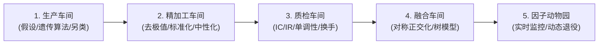
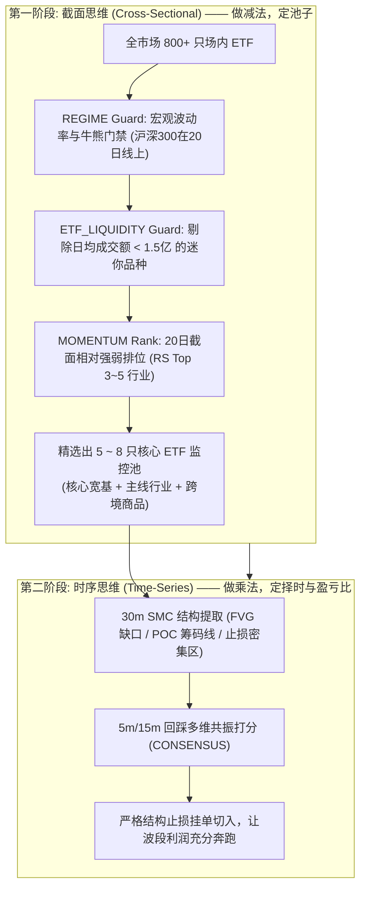
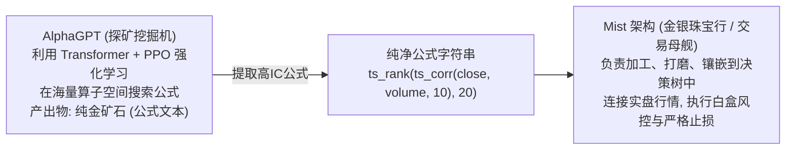
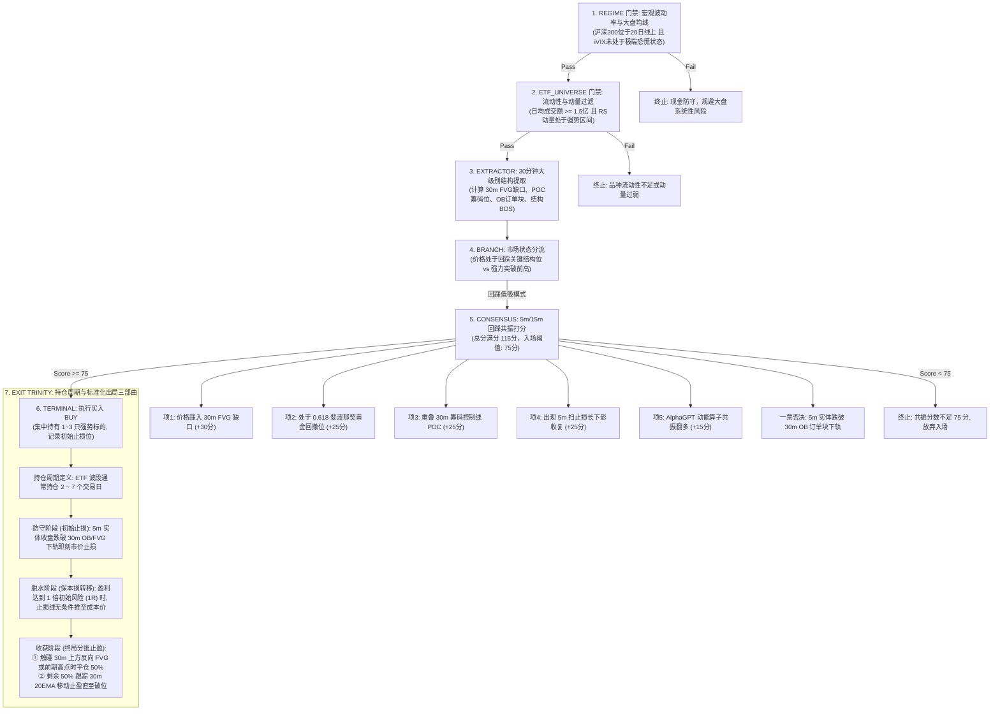
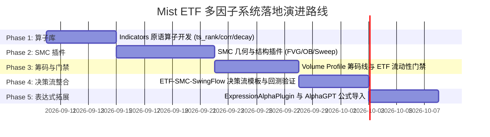

# Mist 多因子体系与现代 Alpha 架构全景设计指南
## —— 聚焦 ETF 市场的系统化 CTA 决策流设计

> 本文档整理汇总了关于现代量化多因子库、经典量价因子演化历程、工业级量化流水线、个人量化走向系统化 CTA 的必然逻辑、AI 平权时代的陷阱与认知、时序与截面的本质之辨、AlphaGPT 自动因子挖掘架构与定位、聚宽等真实因子平台生态透视、工业界与 Mist 的异同全景对比；重点针对**个股非系统性风险过大**的痛点，将核心战场全面聚焦于**高流动性 ETF 市场**（零印花税、免疫造假退市、趋势纯粹、支持跨境 T+0），并构建了结合 SMC（价格行为/流动性）、订单流筹码分布、宏观波动率与买卖全生命周期闭环的实战决策流蓝图。

---

## 一、 架构背景与设计初衷

在 Mist 系统完成 `add-factor-plugin-decision-flow-architecture` 重构后，核心架构实现了以下重要解耦：
1. **纯函数无状态插件**：每个因子继承 [`FactorPlugin`](file:///Users/moyui/sean/mist/mist/libs/strategy/src/factor/factor.types.ts#L86) 接口，直接消费已对齐清洗的行情序列 [`ProjectedStrategyBar[]`](file:///Users/moyui/sean/mist/mist/libs/strategy/src/factor/factor.types.ts#L53) 与共享黑板，输出标准化的 [`FactorOpinion`](file:///Users/moyui/sean/mist/mist/libs/strategy/src/factor/factor.types.ts#L17)（包含 `action: BUY|SELL|NEUTRAL`、`confidence: 0~1`、`reason`、`evidence`）。
2. **领域中立与树状决策流**：因子不再自行决定仓位或直接发单，而是作为零件装配进树状决策流的 5 种节点中（`GUARD` 门禁短路、`BRANCH` 状态路由、`EXTRACTOR` 特征富化、`CONSENSUS` 局部加权共识、`TERMINAL` 最终裁决）。
3. **从个股泥潭向优质标的跃迁**：摆脱传统个股突发暴雷、财报造假、微盘踩踏的不可控风险，将决策流的落地土壤全面瞄准**宽基与行业主题 ETF 市场**。

---

## 二、 工业界因子库演进与 A 股现状深度反思

### 1. 技术指标库 vs 现代量化 Alpha 库

| 比较维度 | 传统技术指标库（TA-Lib / pandas-ta） | 现代量化 Alpha 库（Qlib / WorldQuant / 国君 191 / Barra） |
| :--- | :--- | :--- |
| **产出目标** | 图表辅助看盘、震荡超买超卖状态、通道 | **连续的预期超额收益预测（Alpha 打分）** 或 截面排序 |
| **计算逻辑** | 固定公式，输出均线、振荡器数值 | **基础原语算子组合**（时序排序、协方差、线性衰减、分位数、极值位置） |
| **主要特征** | 只有价格均值与机械周期振荡 | **量价协同、实体与影线微观博弈、波动率非对称性、高阶矩（偏度/峰度）** |
| **系统实现** | 为每个指标硬编码一个计算函数与类 | **表达式 DSL 引擎**，用公式字符串动态解析生成成百上千个特征 |

### 2. 国泰君安 191（GTJA 191）与经典量价因子的现状

*   **出生背景**：国泰君安金融工程团队于 2017 年发布，针对中国 A 股特有的微观结构（T+1、散户占比高、短期强反转、涨跌停限制），基于高开低收量额与 VWAP（均价）构建的 191 个公式化价量因子。
*   **衰减（Alpha Decay）真相**：
    1.  **市场参与者剧变**：2017 年量化私募仅 1000~2000 亿，如今突破 1.5 万亿。所有头部量化机构的代码库中早就内置了国君 191 与 WorldQuant 101。
    2.  **极度拥挤（Crowding）**：百家机构在日频上运行相似的线性量价背离逻辑，使得超额收益被迅速抹平，甚至因集体调仓产生流动性踩踏。
    3.  **交易成本侵蚀**：短周期日频量价因子的年化换手率高达数十倍，在扣除印花税、佣金与冲击滑点后，微薄的毛收益直接转负。
*   **现代机构的真实用法（角色的蜕变）**：
    *   **不再做直接交易信号**：绝不使用 `Alpha > 0 -> 买入` 这种简单规则。
    *   **作为机器学习的底层原料（Raw Features）**：将这批公式作为原始特征喂入 LightGBM、XGBoost、Transformer 等非线性模型，让 AI 学习动态交互。
    *   **作为负向风控门禁（Guard）**：利用其量价极度背离、动能衰竭指标，作为“追高风险过滤”或“筹码松动一票否决”。

---

## 三、 工业级量化流水线：专业机构是如何做因子的？

在现代工业级量化机构（如 Citadel、Two Sigma、WorldQuant、幻方、九坤、明汯、衍复）中，因子研发是一套高度标准化、统计极其严密的**工业制造流水线**，涵盖五大标准车间：

### 1. 第一车间：因子生产（Factor Mining）
*   **逻辑与假设驱动（Hand-crafted / Hypothesis-driven）**：由量化研究员基于金融学与行为金融学提出假设（如“散户早盘冲动交易导致价格偏离，机构尾盘 TWAP 建仓带来重心稳定”），针对性构建特征。
*   **机器自动挖掘（Machine / AI Auto-Mining）**：使用符号回归遗传算法（如 gplearn、AlphaGen），在夜间利用算子树（`ts_rank`、`corr`、`std` 等）自动杂交变异，每天生成数万个新候选因子。
*   **另类数据驱动（Alternative Data）**：利用大模型秒级提取公告舆情、供应链发票异动、电商高频销售等。

### 2. 第二车间：数学精加工（Data Preprocessing）
> **工业铁律：任何原始因子值（Raw Value）严禁直接输入模型，必须经过三道清洗。**

*   **去极值（Winsorization）**：采用 **MAD（中位数绝对偏差法）** 或 **3-Sigma 原则**，将妖股或突发异动产生的离群极大值削平压缩到阈值边界，防止污染全局统计。
*   **标准化（Normalization）**：对全市场截面执行 **Z-Score** 变换（减均值除以标准差），统一量纲；或做 **Rank 分位数标准化**（映射到 0~1 区间）。
*   **核心工序：中性化（Neutralization / 残差化）**：
    *   *伪 Alpha 的陷阱*：例如“高换手率因子”过去几年收益极佳，但其实是因为小盘股天然换手率高，该因子本质只是吃“小盘股暴涨风格（Size Risk）”，一旦小票崩盘便全军覆没。
    *   *回归取残差*：每日对全市场股票做多元线性回归：
        $$\text{原始因子} = \beta_1 \cdot \text{市值因子} + \beta_2 \cdot \text{行业哑变量} + \epsilon$$
    *   取回归残差 $\epsilon$ 作为新因子，彻底剥离市值与行业影响，得到**纯净特质 Alpha（Pure Alpha）**。

### 3. 第三车间：因子质检（Factor Evaluation）
> **业余量化看回测收益曲线，工业量化看统计显著性检验（完全不写买卖策略）。**

*   **IC（Information Coefficient，信息系数）**：
    *   度量今天因子值与未来涨幅的 Spearman 秩相关系数（Rank IC）。
    *   *工业标准*：A 股日频 Rank IC 均值能稳定在 **0.03 ~ 0.06（3%~6%）**，即属于顶尖的印钞机级因子。
*   **IR（Information Ratio，信息比率 / 稳定性）**：
    *   $$IR = \frac{\text{Mean}(IC)}{\text{Std}(IC)}$$
    *   衡量因子表现是否受大盘行情周期摆布。工业界门禁通常要求 **$IR > 0.5$ 合格，$IR > 1.0$ 卓越**。
*   **分层单调性测试（Quantile Test / 10分组收益）**：
    *   将标的按因子值从高到低切成 10 组，观察各组未来收益率。
    *   **必须呈现严格的单调递增阶梯状**（第1组 > 第2组 > ... > 第10组）。若仅第一组暴利而中间各组混乱，判定为过拟合直接弃用。
*   **半衰期与换手衰减（Half-life & Turnover）**：
    *   统计因子自相关性衰减速度。若半衰期仅 1 天，过高的调仓换手成本会直接吞噬净收益。

### 4. 第四车间：因子正交化与降维融合（Combination）
*   **对称正交化（Symmetric Orthogonalization / 罗文斯正交）**：消除因子库内成百上千个因子之间的多重共线性，将其转换为彼此完全独立（相关系数为 0）的正交特征向量。
*   **非线性模型融合**：将正交清洗后的特征矩阵喂给 **GBDT / LightGBM 树模型** 或 **Transformer / 时序深度学习模型**，让算法动态学习不同市场环境下的非线性权重。

### 5. 第五车间：因子动物园与动态退役（Factor Zoo & Governance）
*   **滚动 IC 监控**：24小时跟踪近 20 天滚动 IC，一旦持续走平或翻负触发衰减预警。
*   **拥挤度度量（Crowding Metric）**：跟踪多头组合换手率与同行重合度，防范流动性踩踏。
*   **动态新陈代谢**：保持“每天自动上线新因子、退役衰减因子”的生命周期闭环。

---

## 四、 个人量化的战略分水岭：为什么聚焦 ETF 市场的系统化 CTA 是唯一正道？

### 1. 为什么“个股风险过大”，散户绝不能碰个股量化？

个人投资者或小团队做量化，如果将精力耗费在 5000 只 A 股个股上，必然面临无法解决的**非系统性致命风险（Idiosyncratic Risks）**：
1.  **突发黑天鹅暴雷频发**：财务造假、立案调查、控股股东非理性减持、突发被实施 ST，甚至一字跌停关门打狗，策略设置的止损单根本无法成交。
2.  **微观流动性骤然枯竭**：很多中小盘个股平时看起来活跃，一旦大盘回调，买一卖一挂单瞬间变薄，百万元资金出局就会砸出 2%~3% 的严重冲击滑点。
3.  **两难死局（分散即磨损，集中即猝死）**：
    *   如果像机构一样分散买 50~100 只个股：根本不具备机构的万亿对冲工具与纳秒算法，微薄的收益直接被印花税、佣金和持仓管理成本磨损殆尽；
    *   如果集中持仓 2~3 只个股：哪怕技术指标再完美，只要踩中一只黑天鹅，全年的量化利润瞬间归零甚至本金重创。

### 2. ETF 市场的五大非对称降维优势（个人量化的天然沃土）

转向**场内 ETF（宽基指数 ETF + 行业主题 ETF + 跨境与商品 ETF）**，是个人量化最明智的战略破局点：

| 对比维度 | A 股个股交易 | 场内 ETF 交易（Mist 核心战场） | 战略意义 |
| :--- | :--- | :--- | :--- |
| **交易印花税** | **单边征收 0.05%**（卖出扣除） | **免征印花税（0%）！** | **年化直接省下 2%~5% 纯利润**，换手无负担 |
| **违约与退市风险** | 突发 ST、业绩暴雷、造假退市 | **零退市风险**（指数自动优胜劣汰调仓） | 彻底免疫非系统性黑天鹅，晚上睡得香 |
| **盘口流动性与滑点** | 中小盘买卖挂单薄，滑点高达 0.3%+ | 主流 ETF 日成交数亿至百亿，价差常年 **0.001 元** | 冲击成本趋近于零，策略容量充裕 |
| **趋势纯度与宏观逻辑** | 庄家对倒、做线骗线、微盘踩踏 | 宏观资金、外资与国家队真金白银博弈，**趋势纯粹** | 形态学（SMC/Volume Profile）有效性大幅提升 |
| **交易制度与灵活性** | 严格 T+1，当日买入被套无法动弹 | **部分支持 T+0！**（恒生科技、纳指、日经、黄金等） | 拥有跨境多资产对冲与日内敏捷风控武器 |

### 3. 资金体量决定的数学必然：机构多因子 vs 个人 ETF CTA

| 对比维度 | 机构多因子指数增强（Index Enhancement） | 个人系统化 ETF CTA（Trend & Wave） |
| :--- | :--- | :--- |
| **标的范围** | 全市场 5000 只个股中选 1000~2000 只 | **5~8 只核心高流动性 ETF 精选池** |
| **盈利数学模型** | **高胜率（52%）、低盈亏比（1:1）** 依靠几万次交易的大数定律微弱抽水 | **适中胜率（40%~48%）、极高盈亏比（3:1 甚至 5:1）** “截断亏损，让利润在行业与指数波段中奔跑” |
| **网速与内卷** | 机房微秒级军备竞赛、拼高频与订单簿 | **完全免疫速度内卷**（30m/日线级别看结构，5m进场） |
| **操作策略** | 每日全天候被动满仓对冲 | **顺势吃主升浪，逆风全额现金空仓防守** |

### 4. 改良版 ETF 波段 CTA 三大生存法则

1.  **大盘走熊时拥有 100% 现金空仓防守权**：ETF 最大的优势是进出极其灵活。通过 `REGIME Guard`（沪深300/中证1000 大盘均线与波动率），一旦大盘进入下降通道，策略全额持有现金休眠，规避漫长阴跌。
2.  **“顺大势，逆小势”在关键结构位低吸，坚决不追高**：以 30m/日线确立 ETF 顺势方向，在 5m/15m 回踩关键结构位（FVG 缺口、0.618 黄金位、POC 筹码线）切入，杜绝冲动追涨被套。
3.  **核心池极度聚焦**：坚决剔除成交清淡的“迷你 ETF”，只做**日均成交额 $\ge 1.5$ 亿元**的主流品种。

---

## 五、 AI 平权时代的量化反思与经典陷阱排雷

### 1. AI 平权下的护城河迁移
*   在现代大模型辅助下，代码编写与指标复现的边际成本趋近于零。
*   **代码不再是壁垒，真正的护城河变成了「金融微观博弈的认知深度」与「风控执行的严密性」**。

### 2. 标的土壤与策略基因匹配
*   海龟交易法则、双均线突破在**黄金 ETF、美股纳指 ETF、BTC** 上常年有奇效，是因为这些标的具有全球共识、强流动性与宏观大单边波段。
*   如果将死板的均线金叉直接套用在 A 股普通猴市个股上，频繁的假突破和洗盘会迅速磨光本金。**策略必须与标的的波动率和趋势纯度基因相匹配**。ETF 兼具宽基指数的稳健与行业主题的爆发力，是最优质的策略土壤。

### 3. 为什么转战 ETF 彻底避开了“微盘股毒蜜糖”？
*   在果仁网等低代码平台上，新手很容易用“市值最小前 50 只”在 2021~2023 年调出夏普 3.5 的“神级虚假曲线”。
*   2024 年初微盘股踩踏血案，两周暴跌 50%，大量量化私募跌破止损线。其根本原因在于那些策略吃的是**流动性折价与退市风险暴露**。
*   **转战 ETF 彻底切断了这一毒瘾**：ETF 是一篮子经过交易所严格编制与成份股分红优选的指数凭证，根本不存在个股退市和突发暴雷风险。我们赚的是**宏观趋势与资金流动性失衡（SMC）的真钱，绝不赚退市悬崖边的假钱**。

### 4. 科学祛魅：奇思妙想 + 严格数学验证
*   量化彻底终结了“民间股神悟道”的玄学文化。
*   从观察到一个假说（如“30分钟大阳线失衡必有回踩”），到严格用代码几何定义（FVG 矩形真空），再到跨越数万根 K 线的大样本统计回测，**让概率与数学说话，杜绝感性自我欺骗**。

---

## 六、 时序（Time Series）vs 截面（Cross-Sectional）的本质之辨与 Mist 融合之道

### 1. 核心定义与对立统一

| 核心问题 | 时间序列因子（Time Series - TS） “这只 ETF 未来自己会涨还是会跌？” | 截面因子（Cross-Sectional - CS） “全市场几十只行业 ETF 里，谁比谁更强？” |
| :--- | :--- | :--- |
| **典型代表** | 趋势跟踪、均值回归、海龟法则、SMC、CTA、波动率挤压 | 行业动量轮动（RS 排位）、成交额排名、动量倾角排位 |
| **底层武器** | 动量、结构形态、流动性失衡、支撑阻力、盈亏比管理 | 截面相对强弱排名（`cs_rank`）、大数定律、组合再平衡 |
| **交易结果** | 输出具体的**买卖信号与止损位**（开仓/平仓/空仓） | 输出不同 ETF 间的**配置优先级与关注池名单** |
| **最大成本** | 震荡市中的假突破试错成本（挨打打脸） | 高换手率带来的交易摩擦成本（ETF 免印花税大幅化解了此项） |

### 2. 为什么树模型 60% 预测胜率依然亏钱？（盘口摩擦的致命侵蚀）
*   在短周期（如 10 分钟）上，机器学习模型预测涨跌的平均单笔空间往往只有 **0.2% ~ 0.3%**。
*   而买卖买一卖一价差（Spread）、冲击滑点与手续费，一进一出直接损耗 **0.15% ~ 0.2%**。
*   **胜率是虚幻的，空间与盈亏比才是真实的**。没有足够的波段空间（3%~10%+），微小的预测胜率优势会被交易摩擦无情吞噬。

### 3. 为什么“在止损密集区挂单”往往获利颇丰？（微观博弈真相）
*   散户将止损单整齐排列在前低下方或前高上方。
*   主力大资金受制于冲击成本，缺乏对手盘，必须故意砸盘/拉抬刺破前高前低，**将散户的止损盘（市价卖单/市价买单）强行逼出以完成巨量流动性吃单**，随后反向暴力拉回（长针反包）。
*   在止损密集区（Liquidity Pool）挂单低吸，本质就是利用 SMC 流动性掠夺（Liquidity Sweep）原理，**在主力洗盘的终点与主力同向进场，获得极佳的盈亏比与安全垫**。

### 4. Mist 决策流中的终极结合：截面定池，时序择时

*   **截面（CS）做减法**：不做 1000 只股票分散，利用宏观门禁、流动性门禁和 20 日动量排位，从全市场数百只 ETF 中筛选出最具主线爆发力的 **5~8 只监控池**。
*   **时序（TS）做乘法**：针对监控池，利用 SMC 结构、Volume Profile 筹码控制线寻找**散户止损密集的极佳低吸共振点**，用严格止损截断亏损，用大波段放大盈亏比。

---

## 七、 AI 自动因子挖掘：从 AlphaGPT 案例看“采矿机与交易母舰”的生态结合

### 1. 概念厘清：“探矿挖掘机” vs “交易执行母舰”
很多开发者第一次接触 `AlphaGPT`（`imbue-bit/AlphaGPT`）这类代码库时会感到极其晦涩，因为**它压根不是用来直接发单的交易系统，而是一个纯粹的元工具（Meta-tool）——“自动制造数学公式的工业挖掘机”**。

*   **AlphaGPT 的代码画像**：里面没有买卖点，全是 AST 语法树编译器、逆波兰表达式、Transformer 策略网络、PPO 优势估计、PyTorch 矩阵张量。它在玩一个游戏：“如何组合数学算子，让输出序列与未来收益的 Rank IC 最大化”。
*   **Mist 的代码画像**：真正的实盘作战体系，涵盖 TDX/QMT 毫秒行情接收、Redis 1m/5m 分桶、BullMQ 异步管道、状态机、`GUARD ➔ CONSENSUS` 决策流、微信通知与交易风控。

### 2. 深度解惑：为什么日频量价公式衰减了，AlphaGPT 的公式依然有价值？
> **关键认知分水岭**：
> 1. **死掉的是**：在日线级别全市场 5000 只个股上，做**无上下文、线性的直接交易信号**（如 `Alpha > 0 买入`），在个股印花税、冲击滑点和机构内卷下被彻底榨干；
> 2. **活下来的是**：公式背后的**高阶时序算子（`ts_corr`, `ts_rank`, `ts_decay_linear`）**，当将其应用在 **ETF 市场的 5m/15m/30m 分钟级 K 线** 上时，由于 ETF **零印花税、价差仅 0.001 元**，摩擦大幅降低！
> 3. **用法蜕变**：公式不再单独决定买卖，而是作为 Mist 决策流 `CONSENSUS` 节点中的**“微观动能辅助打分项”（权重 15%~20%）**。当 30m SMC 结构到位时，公式给出的动能打分提供了极佳的入场共振确认。

### 3. AlphaGPT 对 Mist 的核心价值与落地桥接
开发者**完全不需要去重新造挖掘机的发动机（死磕复杂的强化学习底层）**，我们只需将其作为**外部的“灵感与公式供给站”**，与 Mist 形成无缝互补：

1.  **算子语法对齐 ➔ 打造 Mist 的 `ExpressionAlphaPlugin`**：
    *   在 Mist 的 `@app/indicators` 中实现一套标准时序算子（`ts_rank`, `ts_corr`, `ts_decay_linear` 等）。
    *   在 Mist 中开发统一的表达式因子插件 `ExpressionAlphaPlugin`。
    *   AlphaGPT 挖出来的任何高分公式文本（如 `"ts_decay_linear(ts_corr(close, volume, 10), 5)"`），**无需写一行新代码，直接作为参数贴入 Mist 决策流配置即可秒级生效！**
2.  **用 Mist 的微观结构修复 AlphaGPT 的“纯数学近视眼”**：
    *   纯机器公式最大的弱点是“数学 IC 虽高，但易遭遇假突破磨损与流动性枯竭”。
    *   将 AlphaGPT 因子作为 Mist 决策流 `CONSENSUS` 节点的打分项（15分权重）；
    *   由 Mist 的 `REGIME Guard`（大盘牛熊）和 `ETF_LIQUIDITY Guard`（流动性门禁）负责宏观排雷；
    *   由 Mist 的 **SMC（FVG 缺口/流动性掠夺）** 和 **Volume Profile（POC 筹码线）** 负责精准的微观低吸与挂单止损。
    *   **这种“AI 量价动能 + ETF 零印花税 + SMC 结构低吸”的结合，是化解纯数学因子摩擦损耗的终极解法。**

---

## 八、 真实因子平台（聚宽 JoinQuant）上的开源因子类型与评测体系

在聚宽（JoinQuant）、米筐（RiceQuant）等真实的量化因子社区中，大家展示与开源的因子主要呈现以下格局：

### 1. 真实因子平台的五大主力门类
1.  **经典工业级量价 Alpha 库（热度最高）**：
    *   `alpha101`（WorldQuant 101）与 `alpha191`（国泰君安 191）的完整复现；
    *   遗传算法（GP）生成的非线性量价算子组合。
2.  **Barra 风格与风险因子（机构标准基准）**：
    *   估值（BP/EP）、市值（LNCAP）、动量（RSTR）、残差波动率（DASTD）、流动性（STOM）。
3.  **行业与指数动量轮动因子（最适合 ETF）**：
    *   多周期收益率加权动量、动量加速度（Momentum Slope）、成交额乖离率、ETF 溢价率偏离。
4.  **高频降频因子与集合竞价异动**：
    *   9:25 集合竞价量比与跳空开盘溢价、全天 VWAP 重心偏离度、上下午成交量偏好比率。
5.  **资金与情绪类因子**：
    *   ETF 份额连续净申购/净赎回比例、两融余额异常异动。

### 2. 平台的标准“体检报告”（Alphalens / jqfactor_analyzer）
在因子平台上，开源一个因子不是贴几张 K 线图，而是必须出具标准“四图体检表”：
*   **累积 IC 时序曲线**：检验预测能力随时间的持续稳定性，必须平稳向上爬升。
*   **10 分组收益阶梯柱状图**：检验分层单调性（第 1 组收益最高，第 10 组收益最低），严防过拟合。
*   **多空净值曲线（Top 10% 减 Bottom 10%）**：评估纯粹的多空阿尔法收益与最大回撤。
*   **因子自相关衰减图**：评估半衰期与换手率，防范交易摩擦吞噬收益。

### 3. 核心启发：聚宽因子如何为 Mist 所用？
*   **真相**：聚宽上的因子虽然最终用于“全市场截面选股”，但**剥开外层的 `cs_rank` 排名，其内层的绝大部分量价特征（如动量衰减、量价相关、开盘溢价、成交量脉冲），全都是纯粹的单品种时间序列计算！**
*   **降维利用**：Mist 的 `FactorContext`（消费 `bars: ProjectedStrategyBar[]`）天然拥有计算这些特征的全部行情原料。我们可以直接把聚宽中高 IC 的动能内核提炼为 Mist 的 `FactorPlugin`，挂载在 `CONSENSUS` 节点中作为波段共识打分。

---

## 九、 工业界与 Mist 的异同全景透视：“航空母舰” vs “隐形导弹快艇”

| 对比维度 | 工业界（百亿私募 / 公募量化） —— 【万吨级航空母舰】 | 我们当前的 Mist 体系（聚焦 ETF 的精锐战车） —— 【轻盈隐形导弹快艇】 |
| :--- | :--- | :--- |
| **交易战场** | **5000 只 A 股全市场选股**（深陷个股雷区） | **5~8 只高流动性 ETF 精选池**（零印花税、零暴雷） |
| **最终输出** | **全市场 5000 维的预期收益向量** $\mathbf{\hat{r}}$ | **明确的离散波段指令：`BUY` / `SELL` / `CASH_DEFENSE`** |
| **投资组合构建** | **凸二次规划器（Optimizer）** 求解马科维茨风险矩阵，强制行业与市值偏离压到 0% | **树状决策流（Decision Tree Flow）** `GUARD ➔ EXTRACTOR ➔ CONSENSUS ➔ EXIT` |
| **持仓结构** | **极度分散（1000 ~ 2000 只个股）** 单票仓位仅 0.05% ~ 0.2% | **高度聚焦（集中持有 1 ~ 3 只强势 ETF，或全额现金）** |
| **信号逻辑** | **连续微积分预测（微弱抽水）** 每天预测涨跌几个基点，靠万次下注的大数定律 | **结构化高赔率共振（非对称大盈亏比）** SMC 缺口回踩、筹码 POC、扫止损反包，追求 1:3 甚至 1:5 盈亏比 |
| **交易执行** | **纳秒级 DMA 专线 + 算法拆单** TWAP / VWAP / POV，为几万个碎单抢吃盘口微观价差 | **30m/5m 关键位低吸挂单 + 严格结构止损** 不拼纳秒网速，ETF 盘口买一卖一价差仅 0.001 元，一键成交 |
| **完全相同的底层基因** | 1. **数据治理**：防未来函数、严格时钟对齐、停牌填补 2. **因子解耦**：无状态纯函数计算 3. **前置风控**：风格隔离、大盘牛熊门禁 4. **白盒追踪**：全链路因果审计，每笔交易死因清清楚楚 | 1. **数据治理**：`ProjectedStrategyBar` 与时钟完全对齐 2. **因子解耦**：`FactorPlugin` 标准纯函数接口 3. **前置风控**：`REGIME Guard` 与 `ETF_LIQUIDITY Guard` 4. **白盒追踪**：`trace`、`breakdown`、`reason` 完整审计 |

> **战略定论**：不要试图开着航空母舰去内河打仗。散户几十万、几百万资金照搬机构买 1000 只个股搞多因子，光是 0.05% 印花税和个股踩雷风险就能把账户拖死。Mist 聚焦免印花税的 ETF 市场，结合机构级数据严谨度与高赔率波段弹性，是个人量化的降维破局之路。

---

## 十、 适合 ETF 市场的实战核心因子体系

### 1. 价格行为学（Price Action）与 SMC（Smart Money Concepts）
> **本质**：用纯几何与 K 线形态度量国家队、外资与主力在 ETF 盘面上留下的流动性痕迹，彻底规避传统指标滞后性。

| 概念名称 | 核心逻辑 | 交易行为与实战意义 | 决策流定位 |
| :--- | :--- | :--- | :--- |
| **FVG (Fair Value Gap) 价值失衡缺口** | 强力单边大阳线出现时，第 1 根的最高价与第 3 根的最低价之间完全无重叠，留下真空区。 | ETF 价格未来大概率回踩（Retest）此缺口，缺口带具备强支撑效应。 | `EXTRACTOR` 提取关键回踩支撑带 |
| **Liquidity Sweep 流动性掠夺 / 扫止损** | 价格故意刺破前期低点（扫多头止损盘），随后在 5m 级别迅速长影线强力收回复位。 | 识别主力资金在关键支撑位的洗盘与诱空吃单，出现长影线反包为高胜率左侧低吸点。 | `CONSENSUS` 高权重反转共振分 |
| **Order Block (OB) 机构订单块** | 一波剧烈单边启动前的最后一根反向阴线（或变盘基准 K 线）。 | 主力大笔挂单、最终促成波段爆发的真实建仓成本区，提供极强的底线防守。 | `EXTRACTOR` 写入结构防守与止损锚点 |
| **BOS / MSS 结构突破与结构转变** | 顺势突破前期波段高点（BOS），或逆向跌破/突破最后防守波段拐点（MSS）。 | 标志着多空主控权的正式易手，顺势主升浪的启动确认。 | `BRANCH` 路由趋势主升与震荡模式 |

### 2. 斐波那契（Fibonacci）与多重共振（Confluence）
*   **核心认知**：斐波那契（0.382 / 0.5 / 0.618）是全球量化和技术交易者的心理共识。**在真空中单独使用胜率不高，必须作为共振工具**。
*   **黄金共振（Golden Pocket Confluence）**：
    *   当 ETF 价格回调至 0.618 ~ 0.5 区间时，**同时**满足：
        1. 恰好落入 30 分钟级别的 FVG 失衡缺口；
        2. 踩在成交量控制线 POC 处；
        3. 出现 5m 级别的长下影扫止损收复。
    *   **系统定位**：`CONSENSUS` 节点的关键加分项（非独立硬门禁）。

### 3. 成交量分布与筹码结构（Volume Profile / VPVR）
*   **在 ETF 上的巨大优势**：ETF 成交高度透明且没有游资锁仓庄股的虚假控盘，Volume Profile 能极度真实地反映全市场资金在此 ETF 上的持仓成本中枢。
*   **核心关键指标**：
    *   **POC (Point of Control，筹码控制线)**：计算周期内成交量最密集的绝对价格水平，是最强引力与支撑阻力中枢。
    *   **VAH / VAL (Value Area High / Low，价值区高低轨)**：涵盖了 70% 成交量的核心价值区间。
    *   **LVN (Low Volume Node，低成交量真空带)**：成交量稀少的区间，价格一旦进入往往会快速穿透。
*   **工程可行性**：直接利用我们现有的 `bars[].volume` 与 `bars[].ohlc.close`，按价格 Bucket 做累加统计，零外部依赖。

### 4. 宏观波动率与市场环境状态机（Regime & Volatility）
*   **度量标的**：
    *   300ETF / 50ETF 期权隐含波动率（中国波指 / iVIX）；
    *   全市场指数（沪深300 / 中证1000）的 20 日真实历史波动率（HV）。
*   **实战状态机逻辑**：
    *   **低波动率蓄势期（Vol Squeeze）**：波指降至历史极低分位（< 15%），全市场横盘震荡。策略准备动量突破（Breakout），绝不追涨杀跌。
    *   **高波动率恐慌期（Vol Spike）**：极端利空踩踏，波指急剧飙升。策略禁止顺势做多，切换为全额现金防守休眠。
*   **系统定位**：`REGIME Guard`（全决策流顶层的总开关）。

### 5. ETF 流动性与相对强弱门禁（ETF Universe & Momentum Guard）
*   **流动性底线（Liquidity Threshold）**：
    *   **日均成交额 $\ge 1.5$ 亿元**（卡死此线，彻底过滤掉 500 多只日成交几十万、几百万的“迷你僵尸 ETF”，保障滑点小于 0.05%）。
    *   **折溢价率在正常范围（$|\text{Premium Rate}| < 0.8\%$）**，防止遭遇场内过度投机炒作带来的折溢价均值回归杀跌。
*   **截面相对强弱轮动（RS Momentum Rank）**：
    *   计算各行业 ETF 近 20 日的相对强弱指数（RS = ETF涨幅 / 沪深300涨幅）；
    *   只在 RS 排名前 3~5 名的主线行业 ETF 以及宽基/跨境代表 ETF 中寻找交易机会。

---

## 十一、 推荐的决策流装配蓝图（Blueprint）与出局闭环

以下展示如何在 Mist 现有的树状决策流架构中，装配一套从**大盘门禁 ➔ 流动性定池 ➔ 30m 结构提取 ➔ 5m 回踩打分 ➔ 买入 ➔ 止损与止盈全生命周期出局**的标准化 ETF CTA 决策流：

### 权重打分与灵活共振设计（解决单一瓶颈问题）
*   **总分 115 分，入场门槛 75 分**：
    *   **组合 A**：`FVG(30) + 斐波那契(25) + POC(25) = 80分`（经典黄金回撤低吸，无需扫止损信号即可入场）；
    *   **组合 B**：`POC(25) + 扫止损(25) + 斐波那契(25) = 75分`（**即便没有 FVG 缺口**，筹码线扫止损强共振依然能够触发开仓！彻底解决单一项硬瓶颈）；
    *   **组合 C**：`FVG(30) + 扫止损(25) + Alpha动能(15) = 70分`（若有 POC 则 95 分暴力买入）。

### 终局出局机制（Exit Trinity 三部曲）
1.  **持有周期（Holding Horizon）**：以 30m 结构为基准的 ETF 波段，健康持仓周期通常为 **2 ~ 7 个交易日**（跨境 T+0 品种支持日内平仓或隔夜波段）。
2.  **初始硬止损（Initial Structural Stop）**：止损点锚定在 30m OB 订单块或 FVG 缺口下轨下方 1 个 ATR。由于在结构极限位低吸，**初始止损空间通常仅为 0.8% ~ 1.5%**，极大降低单笔风险敞口。
3.  **1R 保本损转移（Breakeven Rule）**：当持仓浮盈达到初始止损距离（1R，如赚了 1.2%）时，系统自动将止损价上移至开仓成本线。**彻底消除亏损可能，立于不败之地**。
4.  **双轨止盈出局（Take-Profit）**：
    *   **一阶止盈（锁定胜果）**：当 ETF 价格到达 30m 上方反向流动性高点（EQH）或上方反向 FVG 时，**主动挂单平仓 50%**，锁定 1:2 或 1:3 盈亏比利润；
    *   **二阶跟踪止盈（奔跑吃单边）**：剩余 50% 仓位开启移动止损（Trailing Stop），以 30m 级别的 20EMA 或 ATR 轨道动态上移，直至出现反向 MSS 破位全量离场。

---

## 十二、 工程落地与实施演进路线（分期实施计划）

1.  **阶段一：沉淀纯数学与时序原语算子库（`@app/indicators`）**
    *   实现核心时序算子：`ts_rank`、`ts_argmax`、`ts_argmin`、`decay_linear`、`rolling_corr`、`rolling_std`。
    *   让基础算子成为轻量、高复用的纯数学函数，零外部依赖，供后续所有因子插件共享。
2.  **阶段二：SMC 几何特征与形态插件开发（`libs/strategy/src/factor/plugins/smc/`）**
    *   `FairValueGapPlugin`（FVG 识别与回踩检测）；
    *   `LiquiditySweepPlugin`（流动性掠夺与假突破反包检测）；
    *   `OrderBlockPlugin`（前置变盘订单块定位与防守线）。
3.  **阶段三：筹码成交量分布与 ETF 流动性门禁**
    *   `VolumeProfileExtractor`（基于 K 线量价构建 POC、VAH、VAL 数组）；
    *   `EtfUniverseLiquidityGuard`（日均成交额 $\ge 1.5$ 亿与折溢价门禁）。
4.  **阶段四：预设 ETF 波段决策流模板化（打通实战与回测闭环）**
    *   在策略注册表中组装标准 `EtfSMCVolumeProfileSwingFlow` 模板；
    *   首批标的接入高流动性标杆：**300ETF (510300)、科创50ETF (588000)、恒生科技ETF (513180)、半导体ETF (512480)、黄金ETF (518880)**；
    *   跑通“建仓 ➔ 1R保本损 ➔ 目标位分批止盈 ➔ Trailing Stop”全链路。
5.  **阶段五：表达式插件与 AlphaGPT 桥接（`ExpressionAlphaPlugin`）**
    *   支持字符串表达式 AST 解析，实现离线自动挖掘公式秒级导入并作为动能加分项。
