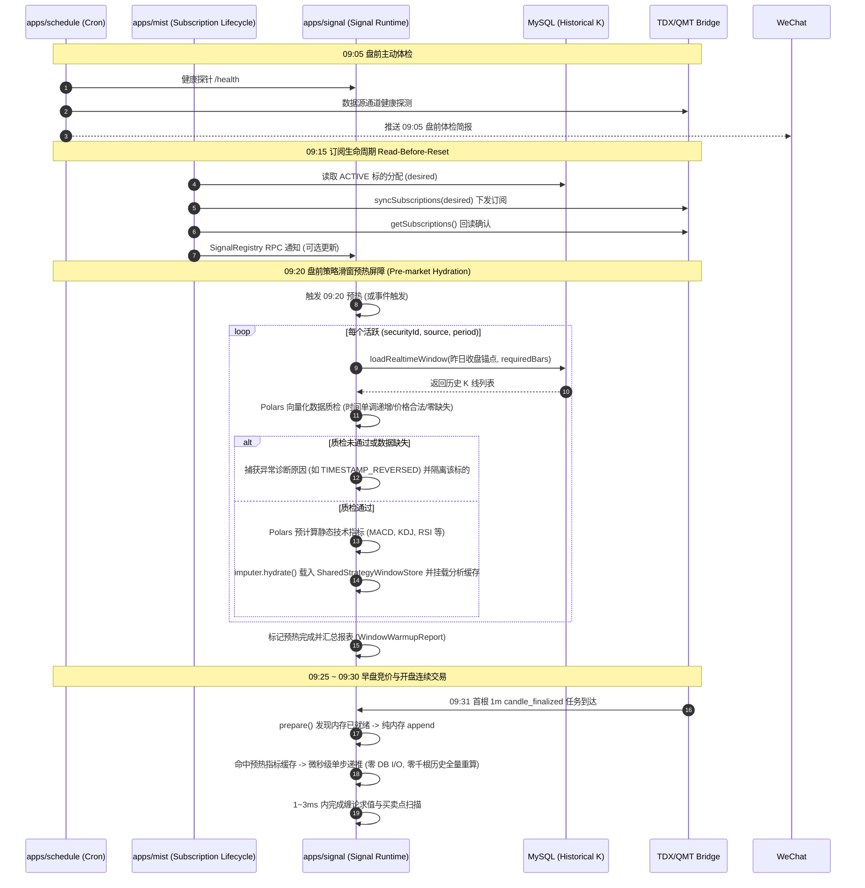

# Design: Pre-Market Strategy Window Hydration and Timeline Governance

## 1. 架构全景与时序流转

### 1.1 盘前时间轴编排（09:05 ~ 09:30）



---

## 2. 核心设计细节

### 2.1 集中调度常量收口 (`@app/timezone`)

在 `libs/timezone/src/cron-schedules.constants.ts` 补充 09:20 盘前预热调度定义：

```typescript
/** 09:20 Asia/Shanghai on exchange trading days (Monday - Friday). Pre-market strategy window hydration barrier. */
export const CRON_PRE_MARKET_STRATEGY_WARMUP_0920 = '0 20 9 * * 1-5';
```

### 2.2 Polars 向量化数据质检与断层扫描 (`validateBarSeriesWithPolars`)

在加载历史 K 线后，利用 `nodejs-polars` 在微秒级完成全量历史 Bar 的列式向量检查，严密拦截潜在脏数据：

```typescript
import pl from 'nodejs-polars';

export type BarSeriesValidationOutcome =
  | { readonly valid: true }
  | {
      readonly valid: false;
      readonly reason:
        | 'insufficient_bars'
        | 'timestamp_reversed'
        | 'invalid_price'
        | 'price_boundary_violation'
        | 'contains_null_or_nan';
      readonly detail: string;
    };

export function validateBarSeriesWithPolars(
  bars: readonly StrategyBar[],
  minRequiredBars: number,
): BarSeriesValidationOutcome {
  if (bars.length < minRequiredBars) {
    return {
      valid: false,
      reason: 'insufficient_bars',
      detail: `expected at least ${minRequiredBars} bars, got ${bars.length}`,
    };
  }

  const timestamps = bars.map((b) => b.timestamp.getTime());
  const opens = bars.map((b) => b.open);
  const highs = bars.map((b) => b.high);
  const lows = bars.map((b) => b.low);
  const closes = bars.map((b) => b.close);

  const df = pl.DataFrame({
    timestamp: pl.Series('timestamp', timestamps, pl.Float64),
    open: pl.Series('open', opens, pl.Float64),
    high: pl.Series('high', highs, pl.Float64),
    low: pl.Series('low', lows, pl.Float64),
    close: pl.Series('close', closes, pl.Float64),
  });

  // 1. 检查是否存在 Null 或 NaN
  const hasNulls = df
    .select(pl.all().isNull().any())
    .row(0)
    .some(Boolean);
  if (hasNulls) {
    return {
      valid: false,
      reason: 'contains_null_or_nan',
      detail: 'bar series contains null or NaN values',
    };
  }

  // 2. 检查时间戳严格单调递增 (diff() > 0)
  const nonIncreasing = df
    .select(
      pl.col('timestamp').diff().slice(1).lessThanEquals(0).any(),
    )
    .row(0)[0];
  if (nonIncreasing) {
    return {
      valid: false,
      reason: 'timestamp_reversed',
      detail: 'bar series contains non-increasing timestamps',
    };
  }

  // 3. 检查价格合法性 (非负数，且 high >= low)
  const priceCheck = df
    .select([
      pl.all().lessThan(0).any().alias('has_negative'),
      pl.col('high').lessThan(pl.col('low')).any().alias('high_less_than_low'),
    ])
    .toRecords()[0] as { has_negative: boolean; high_less_than_low: boolean };

  if (priceCheck.has_negative) {
    return {
      valid: false,
      reason: 'invalid_price',
      detail: 'bar series contains negative price values',
    };
  }
  if (priceCheck.high_less_than_low) {
    return {
      valid: false,
      reason: 'price_boundary_violation',
      detail: 'bar series contains high < low boundary violation',
    };
  }

  return { valid: true };
}
```

### 2.3 `SharedStrategyWindowStore` 主动预热与指标缓存挂载

在 [`SharedStrategyWindowStore`](file:///Users/moyui/sean/mist/mist/libs/signal/src/runtime/shared-strategy-window.store.ts) 中新增 `warmup` 方法，完成历史数据拉取、Polars 质检、指标预计算挂载：

```typescript
export interface WindowWarmupTarget {
  readonly securityId: number;
  readonly source: StrategyRealtimeSource;
  readonly period: number;
  readonly requiredBars: number;
}

export type WindowWarmupFailureReason =
  | 'insufficient_bars'
  | 'timestamp_reversed'
  | 'invalid_price'
  | 'price_boundary_violation'
  | 'contains_null_or_nan'
  | 'query_failed';

export interface WindowWarmupFailureDetail {
  readonly target: WindowWarmupTarget;
  readonly reason: WindowWarmupFailureReason;
  readonly message: string;
}

export interface WindowWarmupReport {
  readonly total: number;
  readonly succeeded: number;
  readonly skipped: number;
  readonly failed: number;
  readonly failedTargets: readonly WindowWarmupFailureDetail[];
}

export class SharedStrategyWindowStore {
  // 现有 prepare / read / retainGroups 逻辑保持不变...

  /**
   * 盘前主动预热指定策略标的窗口
   */
  async warmup(
    marketData: StrategyRealtimeMarketDataPort,
    targets: readonly WindowWarmupTarget[],
    anchorAt: Date,
  ): Promise<WindowWarmupReport> {
    let succeeded = 0;
    let skipped = 0;
    let failed = 0;
    const failedTargets: WindowWarmupFailureDetail[] = [];

    for (const target of targets) {
      const key = groupKey(target.securityId, target.source, target.period);
      const existing = this.groups.get(key);

      // 若已有且容量充足，直接幂等跳过
      if (existing && existing.capacity >= target.requiredBars) {
        skipped += 1;
        continue;
      }

      try {
        const hydrated = await marketData.loadRealtimeWindow({
          securityId: target.securityId,
          source: target.source,
          period: target.period,
          anchorAt,
          requiredBars: target.requiredBars,
        });

        // 1. Polars 向量化质量检查
        const validation = validateBarSeriesWithPolars(
          hydrated.bars,
          Math.min(target.requiredBars, 1),
        );
        if (!validation.valid) {
          failed += 1;
          failedTargets.push({
            target,
            reason: validation.reason,
            message: validation.detail,
          });
          continue;
        }

        // 2. 构建内存滑窗与预热指标缓存
        const group = buildGroup(hydrated.bars, target.requiredBars);
        this.groups.set(key, group);
        succeeded += 1;
      } catch (error) {
        failed += 1;
        failedTargets.push({
          target,
          reason: 'query_failed',
          message: error instanceof Error ? error.message : String(error),
        });
      }
    }

    return Object.freeze({
      total: targets.length,
      succeeded,
      skipped,
      failed,
      failedTargets: Object.freeze(failedTargets),
    });
  }
}
```

### 2.4 触发与执行机制（双重保障）

预热执行由 `apps/signal` 统一托管，采用“**事件触发为主 + 09:20 定时保底**”：

1. **事件触发**：
   - 在 `SignalRealtimeStartupService.onApplicationBootstrap()` 以及 `SignalRegistry` 注册表更新（`reconcileRegistry`）时，提取所有活跃策略的三元组 `(securityId, source, period, maxRequiredBars)`，在后台异步调用 `warmup()`。
2. **09:20 定时保底屏障**：
   - 注册 `@Cron(CRON_PRE_MARKET_STRATEGY_WARMUP_0920, { timeZone: 'Asia/Shanghai' })`。
   - 检查交易日日历（`TimezoneService.isTradingDay`），在 09:20 针对全量活跃策略执行一次扫描与补热，确保所有标的 100% 具备内存滑窗。

### 2.5 失败隔离与退化语义（Failure Isolation & Degradation）

- **单标的故障隔离**：某只股票预热失败（例如历史 K 线缺失、网络抖动、Polars 质检不通过），仅记录 Warning 日志并累加 `failedCount`，**绝对不阻塞其他标的的预热，也绝对不导致 Signal 服务崩溃**。
- **开盘自动退化兜底**：若某标的在 09:20 预热失败，当 09:31 首根 K 线到达时，`prepare()` 会自动走现有的按需拉取（On-demand Hydration）逻辑进行兜底补拉。

---

## 3. 质量门禁合规性审查

### 3.1 命名与词汇合规（`mist/docs/project-quality-governance-guide.md`）
- 严格遵循 `securityId`、`source`、`period`、`anchorAt` 等 canonical 词汇；
- 时间统一基于 `@app/timezone` 的 `Asia/Shanghai` 交易日；
- 绝不引入无作用域的全局 `ready`。

### 3.2 内存边界与奥卡姆剃刀（YAGNI）
- 内存队列严格遵循 `capacity = requiredBars` 限制，超出部分通过 `imputer.trim()` 自动弹出，防止内存泄漏；
- 预热逻辑直接复用现有的 `loadRealtimeWindow` 和 `imputer.hydrate()`，Polars 数据帧在质检完成后立即由 GC 回收，不在内存常驻额外 DataFrame。

---

## 4. 验证计划

1. **单元测试**：
   - `shared-strategy-window.store.spec.ts`：
     - Polars 质检成功路径：有效数据通过质检；
     - Polars 质检失败路径：时间倒流、非正价格、High < Low、缺失值等能被正确捕获；
     - `warmup` 成功载入、容量复用跳过、单标的异常隔离与报告生成。
   - `SignalRealtimeStartupService.spec.ts` / 调度测试：测试 09:20 触发与非交易日跳过逻辑。
2. **集成测试**：
   - 模拟开盘首根 K 线到达，断言内存 `WindowGroup` 命中且未调用底层数据库查询（`kRepository.find` 次数为 0）。
