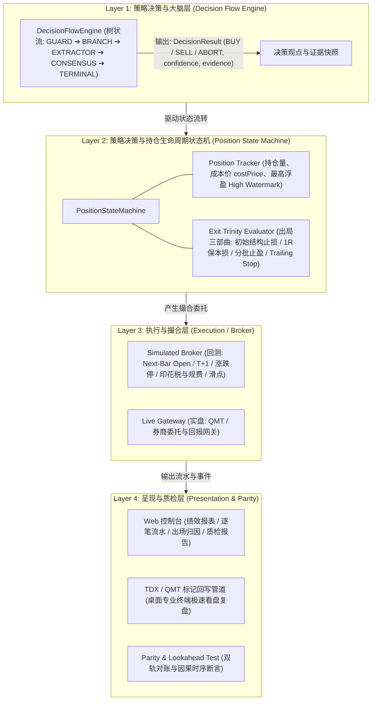
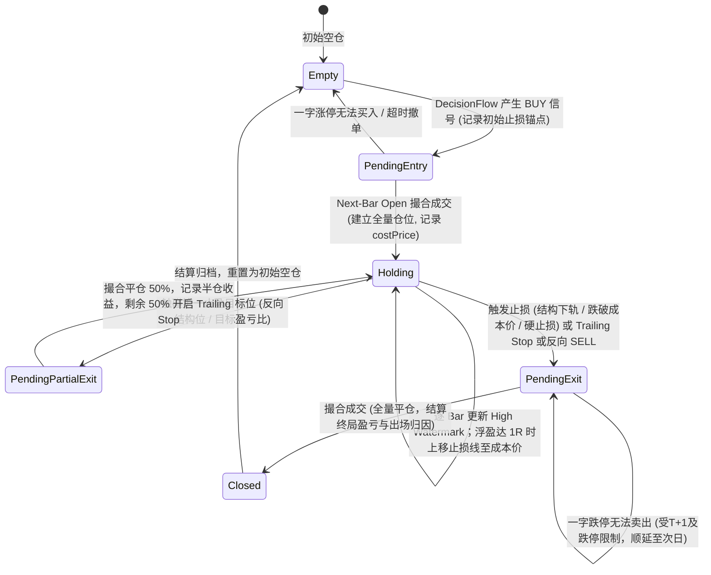
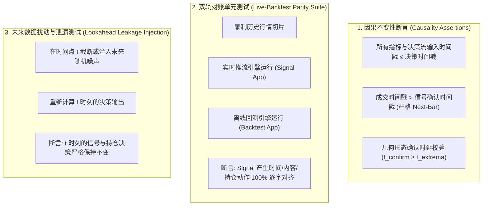
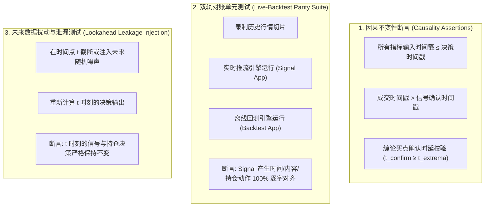

# Design: 量化回测决策状态机、严格 A 股撮合与防未来函数质检体系

## 1. 架构总览



---

## 2. 策略决策与持仓生命周期状态机（Position State Machine）

### 2.1 状态转移图



### 2.2 出场与止损规则配置契约（`StrategyExitPolicy`，全面对齐 Exit Trinity）

```typescript
export interface StrategyExitPolicy {
  // 1. 通用结构止损 (支持从决策流返回的 evidence 中动态提取结构下轨)
  structuralStop?: {
    enabled: boolean;
    source: 'evidence' | 'fixed_price';
    evidenceKey?: string; // 默认 'stopLossPrice'，亦可指定 'chan.central.zd'、'smc.order_block.bottom' 或 'smc.fvg.bottom'
    bufferRatio?: number; // 缓冲比例，如 0.005 (0.5%)
  };

  // 2. 动态保本机制 (支持 1R 保本损转移模式)
  breakEven?: {
    enabled: boolean;
    mode: '1R' | 'profit_ratio'; // '1R': 浮盈达到 1 倍初始风险时保本; 'profit_ratio': 浮盈达到固定百分比时保本
    triggerProfitRatio?: number; // mode 为 profit_ratio 时的阈值 (如 0.03 = 3%)
  };

  // 3. 双轨止盈之移动追踪止盈 (Trailing Stop)
  trailingStop?: {
    enabled: boolean;
    mode: 'callback_ratio' | 'indicator_track'; // 回撤比例模式 或 均线跟踪模式
    activationProfitRatio?: number; // 激活阈值 (如浮盈达到 5% 或 2R)
    callbackRatio?: number; // 从最高点回撤比例 (如 2%) 触发平仓
    indicatorKey?: string; // 跟踪指标破位离场，如 'ema20'
  };

  // 4. 双轨止盈之目标位分批止盈 (Partial Profit)
  partialProfit?: {
    enabled: boolean;
    targetRatio: number; // 达到目标盈亏比 (如 2.5R 或目标位) 触发减仓
    closeRatio: number; // 平仓比例，默认 0.5 (减仓 50%)
  };

  // 5. 硬风控止损 (底线兜底)
  hardStopLossRatio?: number; // 固定止损比例，如 0.05 (5%)

  // 6. 决策流反向卖出信号出场
  oppositeSignalExit?: boolean; // 当决策流产生 action === 'SELL' 确立出场

  // 7. 最大持仓 K 线数超时出场
  maxHoldingBars?: number; // 超过 N 根 Bar 未触发止盈止损强制平仓
}
```

---

## 3. A 股严格成交撮合模型（Lookahead-Free Simulated Broker）

### 3.1 时序与撮合规则

| 动作 | 判定时机 | 撮合时机与价格 | 异常与边界处理 |
| :--- | :--- | :--- | :--- |
| **开仓买入** | Bar $t$ 闭合计算确认决策流 `BUY` | Bar $t+1$ 以 `open` 价格撮合 | 若 Bar $t+1$ 涨停一字板（`open == highLimit`），标记 `BUY_REJECTED_LIMIT_UP`，撤单放弃 |
| **盘中触价止损** | Bar $t$ 处于持仓状态且已过 T+1 | 若 `bar.low <= stopPrice`：<br>• 若 `open <= stopPrice`，以 `open` 成交；<br>• 否则以 `stopPrice` 撮合 | 若 Bar $t$ 跌停一字板（`open == lowLimit`），标记 `SELL_BLOCKED_LIMIT_DOWN`，顺延至次日 |
| **收盘信号/形态卖出** | Bar $t$ 闭合计算满足出场条件 | Bar $t+1$ 以 `open` 价格撮合 | 严格受 T+1 限制（当天买入的标的当天不可卖出，持仓锁定至次日） |

### 3.2 摩擦成本与滑点模型（支持个股与 ETF 差异化费率）

- **股票印花税 (Stamp Duty)**: 卖出单向 `tradeAmount * 0.0005`（**ETF 交易免征印花税**，系统根据标的类别自动免除）。
- **券商佣金 (Commission)**: `max(5.0, tradeAmount * 0.00025)` (买卖双向)。
- **过户费 (Transfer Fee)**: `tradeAmount * 0.00001` (买卖双向)。
- **滑点 (Slippage)**: 默认 0.1% 或固定 1~2 Tick（ETF 盘口价差通常仅 0.001 元，可配置为更低滑点）。

---

## 4. 三维防未来函数质检与对账机制



---

## 5. 实体与数据库设计（Schema Migrations）

### 5.1 `backtest_trade_results` 表（支持全量流水与分批平仓记录）

```sql
CREATE TABLE `backtest_trade_results` (
  `id` INT AUTO_INCREMENT PRIMARY KEY,
  `backtest_run_id` INT NOT NULL,
  `security_code` VARCHAR(20) NOT NULL,
  `entry_signal_time` DATETIME(3) NOT NULL,
  `entry_time` DATETIME(3) NOT NULL,
  `entry_price` DECIMAL(12, 4) NOT NULL,
  `exit_signal_time` DATETIME(3) NOT NULL,
  `exit_time` DATETIME(3) NOT NULL,
  `exit_price` DECIMAL(12, 4) NOT NULL,
  `exit_reason` VARCHAR(60) NOT NULL, -- 'STRUCTURAL_STOP' | 'BREAK_EVEN' | 'PARTIAL_PROFIT' | 'TRAILING_STOP' | 'HARD_STOP_LOSS' | 'OPPOSITE_SIGNAL' | 'TIMEOUT'
  `is_partial` TINYINT(1) NOT NULL DEFAULT 0, -- 是否为半仓分批止盈流水
  `holding_bars` INT NOT NULL,
  `pnl_amount` DECIMAL(14, 4) NOT NULL,
  `pnl_ratio` DECIMAL(8, 4) NOT NULL,
  `pnl_r_multiple` DECIMAL(6, 2) DEFAULT NULL, -- 盈亏 R 计数 (如 +2.5R, -1.0R)
  `total_fee` DECIMAL(10, 4) NOT NULL,
  `context_snapshot` JSON NOT NULL,
  `created_at` DATETIME(3) DEFAULT CURRENT_TIMESTAMP(3),
  INDEX `idx_run_id` (`backtest_run_id`),
  INDEX `idx_security` (`security_code`)
) ENGINE=InnoDB DEFAULT CHARSET=utf8mb4;
```

---

## 6. 与原生终端可视化（QMT / TDX）与 Web 控制台分工

1. **Web 端 (`mist-fe`)**：
   - 任务控制与状态轮询；
   - 量化绩效卡片：总收益率、年化收益率、夏普比率、最大回撤、胜率、盈亏比、交易总次数、平均持仓周期；
   - 逐笔 Trade 流水表格（包含入场时间/价格、出场时间/价格、持仓时长、分批平仓标记、出场归因标签）；
   - 因果质检报告（时序断言与双轨对账状态）。
2. **桌面端 (`TDX / QMT`)**：
   - 通过 `openspec/changes/integrate-native-terminal-visualization` 提供的绘图指令接口，将回测生成的 Trade 序列自动转为买入 Pin 标、卖出 Pin 标、持仓连接线与动态止损警戒线，在桌面专业终端极速复盘。

---

## 4. 三维防未来函数质检与对账机制



---

## 5. 实体与数据库设计（Schema Migrations）

### 5.1 `backtest_trade_results` 表（替代/升级现有仅信号表）

```sql
CREATE TABLE `backtest_trade_results` (
  `id` INT AUTO_INCREMENT PRIMARY KEY,
  `backtest_run_id` INT NOT NULL,
  `security_code` VARCHAR(20) NOT NULL,
  `entry_signal_time` DATETIME(3) NOT NULL,
  `entry_time` DATETIME(3) NOT NULL,
  `entry_price` DECIMAL(12, 4) NOT NULL,
  `exit_signal_time` DATETIME(3) NOT NULL,
  `exit_time` DATETIME(3) NOT NULL,
  `exit_price` DECIMAL(12, 4) NOT NULL,
  `exit_reason` VARCHAR(60) NOT NULL, -- 'STRUCTURAL_CHAN_STOP' | 'TRAILING_STOP' | 'BREAK_EVEN' | 'HARD_STOP_LOSS' | 'OPPOSITE_SIGNAL' | 'TIMEOUT'
  `holding_bars` INT NOT NULL,
  `pnl_amount` DECIMAL(14, 4) NOT NULL,
  `pnl_ratio` DECIMAL(8, 4) NOT NULL,
  `total_fee` DECIMAL(10, 4) NOT NULL,
  `context_snapshot` JSON NOT NULL,
  `created_at` DATETIME(3) DEFAULT CURRENT_TIMESTAMP(3),
  INDEX `idx_run_id` (`backtest_run_id`),
  INDEX `idx_security` (`security_code`)
) ENGINE=InnoDB DEFAULT CHARSET=utf8mb4;
```

---

## 6. 与原生终端可视化（QMT / TDX）与 Web 控制台分工

1. **Web 端 (`mist-fe`)**：
   - 任务控制与状态轮询；
   - 量化绩效卡片：总收益率、年化收益率、夏普比率、最大回撤、胜率、盈亏比、交易总次数；
   - 逐笔 Trade 流水表格（包含入场时间/价格、出场时间/价格、持仓时长、出场归因）；
   - 因果质检报告（时序断言与双轨对账状态）。
2. **桌面端 (`TDX / QMT`)**：
   - 通过 `openspec/changes/integrate-native-terminal-visualization` 提供的绘图指令接口，将回测生成的 Trade 序列自动转为买入 Pin 标、卖出 Pin 标、持仓连接线与动态止损警戒线，在桌面专业终端极速复盘。
